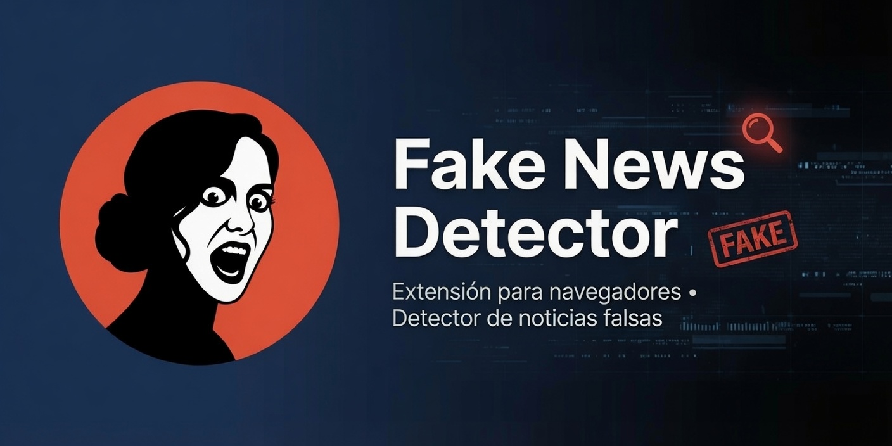

> AI-powered claim fact-checker for Chrome, Edge, and Firefox — detect misinformation as you browse.

# FakeNews Detector

An AI-assisted claim-checking browser extension (Manifest V3).

> **Important:** This extension is a decision-support aid, NOT an infallible lie detector.
> LLM outputs can be wrong, biased, or outdated. Always verify critical claims independently.

---

## Features

- Fact-checks **news articles and text pages** by extracting visible paragraph text and sending it to your chosen LLM provider.
- Fact-checks **audio/video tabs** (YouTube, streaming sites, Instagram Reels/Stories) by capturing tab audio, transcribing it with Whisper or Gemini, then running the same claim-analysis pipeline.
- Shows a **colored glow border** around the page:
  - Green — claims appear true
  - Amber — uncertain / possible misinformation
  - Red (pulsing) — confirmed fake claims detected
  - Gray — not enough data to verify
- Displays a **Spanish-language banner pill** at the top of the page with the verdict summary.
- **Side panel / sidebar** shows each individual claim, confidence score, reasoning, and source links.
- **Day/night theme** with auto, light, and dark modes — toggle from the popup header or set in Options.
- All analysis stays between your browser and the LLM API — no third-party relay server.

---

## Supported browsers & platforms

| Browser / Platform | Text analysis | Audio capture | Panel / sidebar | Notes |
|---|---|---|---|---|
| **Chrome desktop** | Full | Full (tabCapture) | Built-in side panel | Requires Developer Mode |
| **Edge desktop** | Full | Full (tabCapture) | Built-in side panel | Load via `edge://extensions` |
| **Firefox desktop** | Full | — API unavailable | Sidebar (`sidebar_action`) | Build with `python scripts/build_firefox.py`; host perms opt-in in `about:addons` |
| **Firefox for Android** | Full | — | Panel opens as a tab | Requires AMO signing or Firefox Nightly + custom extension collection for permanent install |
| **Safari / iOS** | Requires Xcode conversion | — | — | Use `xcrun safari-web-extension-converter` on macOS; the capability-gated codebase is prepared for this path |
| Chrome / Edge on Android | — | — | — | Extensions not supported by these browsers on Android |
| Chrome on iOS | — | — | — | Extensions are not supported by Chrome on iOS |

> **Note on iOS:** The only extension path on iOS is Safari Web Extension, which requires conversion via Xcode on macOS and distribution through the App Store or TestFlight.

---

## Installation

No build step is required for Chrome and Edge. Vanilla ES modules only.

### Instalar en Chrome

1. Clone or download this repository to your computer.
2. Open a new tab and go to `chrome://extensions`.
3. Enable the **Developer mode** toggle in the top-right corner.
4. Click **Load unpacked**.
5. Select the `FAKENEWS-DETECTOR-PROJECT` folder (the one that contains `manifest.json`).
6. The FakeNews Detector icon appears in the toolbar. Click it to open the popup.
7. Click **Configuración** in the popup (or right-click the icon → **Options**).
8. Choose your AI provider, enter your API key, and click **Guardar configuración**.
9. To pin the icon to the toolbar: click the puzzle-piece (Extensions) icon → click the pin next to FakeNews Detector.

### Instalar en Edge

1. Clone or download this repository to your computer.
2. Open a new tab and go to `edge://extensions`.
3. Enable the **Developer mode** toggle in the bottom-left panel.
4. Click **Load unpacked**.
5. Select the `FAKENEWS-DETECTOR-PROJECT` folder.
6. The icon appears in the toolbar. Click it to open the popup.
7. Click **Configuración** and set your provider and API key.

### Instalar en Firefox (escritorio)

Firefox requires a separate build because its manifest differs from Chrome's.

1. Make sure Python 3 is installed (`python --version`).
2. In a terminal, run the build script from the project folder:
   ```
   python scripts/build_firefox.py
   ```
   The output is written to `dist/firefox/` (gitignored).
3. Open Firefox and go to `about:debugging#/runtime/this-firefox`.
4. Click **Load Temporary Add-on…**.
5. Navigate to `dist/firefox/` and select `manifest.json`.
6. The extension loads. Note: **temporary add-ons are removed when Firefox restarts** — you must reload it each time.

**Host permissions on Firefox:** Firefox treats host permissions as opt-in by default. If the extension does not activate on a site, go to `about:addons` → click the extension → **Permissions** tab and enable site access for the required domains.

**Audio and microphone modes are not available on Firefox.** The `offscreen` and `tabCapture` APIs are Chrome/Edge-only. Text analysis works fully.

> For a permanent non-signed install, use Firefox Nightly with a [custom extension collection](https://support.mozilla.org/en-US/kb/use-extensions-android).

### Conceder acceso al micrófono (Chrome / Edge)

The microphone (vigilante) mode requires a one-time permission grant from a stable page — Chrome closes the popup before you can accept the permission dialog.

1. Open the extension options: click the toolbar icon → **Configuración**.
2. Scroll to the **Micrófono (modo vigilante)** section.
3. Click **Conceder acceso al micrófono**.
4. Accept the browser permission dialog that appears.
5. You will see the confirmation: "Permiso de micrófono concedido." You only need to do this once per browser profile.

After granting permission, click **Analizar micrófono (vigilante)** in the popup at any time to start listening.

---

## Configuration

Open the extension options (click the toolbar icon → **Configuración**, or right-click the icon → **Options**) to set:

| Setting | Description |
|---|---|
| Tema | Auto (system), Claro (light), or Oscuro (dark) |
| Proveedor de IA | Any supported provider or a custom OpenAI-compatible endpoint |
| URL base | Optional override — leave empty to use the official URL |
| Clave de API | Your provider's API key — stored locally only |
| Modelo | Speed-ranked dropdown or free-text for open catalogs |
| Clave STT | Optional Whisper key for audio transcription |
| URL base STT | Optional Whisper endpoint (default: OpenAI) |
| Modelo STT | Optional transcription model (default: `whisper-1`) |
| Intervalo de análisis | Minimum seconds between API calls (default: 12 s) |

---

## Supported providers

### Built-in presets

| Group | Provider | Protocol | Default model | Get a key |
|---|---|---|---|---|
| Principales | **Anthropic (Claude)** | anthropic | claude-haiku-4-5-20251001 | [console.anthropic.com](https://console.anthropic.com/settings/keys) |
| Principales | **OpenAI (ChatGPT)** | openai | gpt-4o-mini | [platform.openai.com](https://platform.openai.com/api-keys) |
| Principales | **Google Gemini** | gemini | gemini-2.0-flash | [aistudio.google.com](https://aistudio.google.com/apikey) |
| China | **DeepSeek** | openai-compat | deepseek-chat | [platform.deepseek.com](https://platform.deepseek.com/api_keys) |
| China | **Qwen / Alibaba** | openai-compat | qwen-turbo | [bailian.console.alibabacloud.com](https://bailian.console.alibabacloud.com/) |
| China | **Kimi / Moonshot** | openai-compat | kimi-k2-turbo-preview | [platform.moonshot.ai](https://platform.moonshot.ai/console/api-keys) |
| China | **GLM / Zhipu** | openai-compat | glm-4.5-air | [open.bigmodel.cn](https://open.bigmodel.cn/usercenter/apikeys) |
| China | **MiniMax** | openai-compat | MiniMax-M2 | [platform.minimax.io](https://platform.minimax.io/) |
| Otros / Local | **Grok / xAI** | openai-compat | grok-4-fast | [console.x.ai](https://console.x.ai/) |
| Otros / Local | **Mistral AI** | openai-compat | mistral-small-latest | [console.mistral.ai](https://console.mistral.ai/api-keys/) |
| Otros / Local | **Groq (Llama)** | openai-compat | llama-3.3-70b-versatile | [console.groq.com](https://console.groq.com/keys) |
| Otros / Local | **OpenRouter** | openai-compat | free text | [openrouter.ai](https://openrouter.ai/settings/keys) |
| Otros / Local | **Ollama (local)** | openai-compat | free text | no key needed |
| Otros / Local | **Personalizado** | openai-compat | free text | depends on provider |

### Use any AI — the OpenAI-compatible standard

The **OpenAI chat completions API** (`POST /chat/completions`) has become the de-facto interoperability standard for LLMs. Any provider that implements it works with this extension — select **Personalizado** and enter the base URL.

The extension sends `response_format: {type:"json_object"}` on the first request and automatically retries without it if the provider rejects it, so you get clean JSON parsing across the widest range of backends.

### Custom base URL — mainland China endpoints

Providers with China-international and China-mainland endpoints differ:

| Provider | International | Mainland China (override in URL base field) |
|---|---|---|
| Qwen | dashscope-intl.aliyuncs.com | dashscope.aliyuncs.com |
| Kimi | api.moonshot.ai | api.moonshot.cn |
| GLM | api.z.ai | open.bigmodel.cn |
| MiniMax | api.minimax.io | api.minimaxi.com |

Set the **URL base** field to the mainland endpoint to switch without changing your API key.

> Models that emit `<think>` reasoning blocks inline (e.g. MiniMax M2.x) are handled automatically — the extension strips those blocks before JSON parsing.

### Ollama — local, fully private

With Ollama, page content goes only to your local Ollama server (`http://localhost:11434`) — nothing leaves your machine. No API key is required. Install a model with `ollama pull llama3.2`, enter `llama3.2` in the model field, and set the base URL to `http://localhost:11434/v1`.

### OpenRouter — one key, many models

OpenRouter provides access to hundreds of models through a single OpenAI-compatible endpoint. Enter any model identifier available on [openrouter.ai/models](https://openrouter.ai/models) in the model field (e.g. `deepseek/deepseek-chat`, `google/gemini-flash-1.5`).

---

## Audio transcription (STT)

| Main provider | STT used | Requirement |
|---|---|---|
| **OpenAI** | Whisper (same key) | None — main key covers it |
| **Gemini** | Gemini multimodal | None — main key covers it |
| Any other provider | OpenAI-compatible Whisper | Set a key in **Clave STT** |
| Whisper via Groq (fast) | Groq Whisper | Set Groq key + URL `https://api.groq.com/openai/v1`, model `whisper-large-v3-turbo` |

> **Firefox:** Audio capture requires `tabCapture` and `offscreen` APIs which are unavailable in Firefox. The audio button is disabled automatically and a hint is shown.

---

## Micrófono — modo vigilante

In addition to capturing tab audio, the extension can listen to your computer's **microphone** — useful for fact-checking live, in-person conversations or anything playing through your speakers when tab capture is unavailable.

### How to use it

1. **First time only** — open the extension **Options**, scroll to the **Micrófono (modo vigilante)** section, and click **Conceder acceso al micrófono**. Accept the browser permission dialog that appears.
2. **After permission is granted** — click **Analizar micrófono (vigilante)** in the popup. The extension hands control to an offscreen document, which records in 6-second segments, transcribes each one with the configured STT pipeline, and fact-checks the result.
3. Audio goes **directly** from your browser to your configured STT provider — no relay server.

> **Privacy note:** Mic audio is sent to the same STT provider you configured for tab audio. Use a self-hosted Whisper server for fully local processing.

### Chrome and Edge only

Microphone capture uses the same offscreen-document API as tab audio capture — both are unavailable in Firefox. The button is automatically disabled in Firefox and a note is shown.

---

## Panel views — Resultados, Conclusión, Historial

The side panel content area is organized into three mutually exclusive views. The header (overall verdict chip, status line, VU meter) and the toolbar stay visible in all views.

### Resultados (default)

The live claim-card feed. New verdicts appear here as analyses complete. This view is the default and is restored automatically when you switch tabs or click **Reiniciar**.

### Conclusión — session verdict summary

Click **Conclusión** in the toolbar to open a full-panel summary view of the current session:

| Part | Detail |
|---|---|
| **Instant local tally** | Verdict counts (Verdadera / Falsa / Dudosa / No verificable) and average confidence — computed immediately from loaded claims, no API call needed. |
| **AI-written conclusion** | An animated spinner appears while the AI generates a 3–6 sentence Spanish-language paragraph about the session's overall reliability. The spinner is replaced by the text when ready, or by an error message if the call fails. |

The **← Resultados** button returns to the claim feed without cancelling a pending AI call — the result arrives and populates the conclusion view whenever it completes.

**Notes:**
- If there are no claims in the current session, a notice is shown and no AI call is made.
- The AI conclusion requires an API key (skipped automatically for Ollama and other keyless providers).
- The button is disabled while the AI call is in progress to prevent duplicate requests.
- The conclusion view resets when you click **Reiniciar** or switch to a different tab.
- The AI conclusion uses the configured provider and has a ~120 s timeout. Reasoning models (MiniMax M2.x, DeepSeek-R1) are slower to conclude — for near-instant conclusions prefer a fast model.
- If a reasoning model returns only its `<think>` reasoning block with no conclusion text, the extension shows a clear Spanish error suggesting a faster model (e.g. DeepSeek-chat, GLM-4.5-Air, or Gemini Flash).

### Historial — per-session response log

Click **Historial** in the toolbar to browse a chronological log of every analysis and conclusion produced during the current tab session:

| Column | Detail |
|---|---|
| **Time** | Timestamp of the response (HH:MM) |
| **Type** | "Análisis de texto", "Análisis de audio", "Análisis de micrófono", or "Conclusión" |
| **Summary** | For analyses: overall verdict + claim count. For conclusions: first ~120 characters of the AI text. |

Click any row to expand it and see the full detail — claim cards for analyses, the full AI text + tally for conclusions. Click again to collapse.

**Notes:**
- History is per-tab session and is capped at the 50 most recent entries.
- Clicking **Reiniciar** clears the history for the current tab along with the claim results.
- History resets when you switch to a different tab.

### Reiniciar — session reset button

The **Reiniciar** button in the toolbar (previously labeled "Limpiar") performs a full session reset for the active tab:

- Stops any running audio or microphone capture and removes the page overlay.
- Wipes all claim results and session history for that tab.
- Clears the auto-mode URL dedupe entry so the same page can be re-analyzed immediately (without waiting for the 10-minute cooldown to expire).
- Resets all three views to their empty state.

---

## VU meter — real-time capture feedback

While any audio capture is active (tab or microphone), the side panel displays a **VU meter** — a row of 16 LED-style bars in the panel header — so you can confirm the extension is actually picking up sound.

| Bar color | Meaning |
|---|---|
| **Green** (bars 1–10) | Quiet signal |
| **Amber** (bars 11–13) | Medium level |
| **Red** (bars 14–16) | Strong / peak signal |
| **All dark** | No capture active, or silence |

The meter animates smoothly: the display decays toward zero within ~400 ms after capture stops or audio falls silent. The label below the bars shows **"Nivel de audio (pestaña)"** or **"Nivel de audio (micrófono)"** depending on which mode is active.

> Both audio capture modes (tab audio and microphone) require **Chrome or Edge**. The VU meter only lights up during those modes.

---

## Audio transcription without a token (self-hosted Whisper)

A hosted, free, no-token STT service with Whisper-grade latency and reliability effectively does not exist. The token-free path is self-hosting. Groq offers a fast, free-tier Whisper API but still requires a (free) API key.

Self-hosting recipe: run any OpenAI-compatible Whisper server, then point the **STT base URL** field at it and leave the **STT key** field empty.

### Local Docker — CPU (speaches)

```bash
docker run \
  --publish 8000:8000 \
  --volume hf-hub-cache:/home/ubuntu/.cache/huggingface/hub \
  --env WHISPER__MODEL=Systran/faster-whisper-small \
  --detach \
  ghcr.io/speaches-ai/speaches:latest-cpu
```

| Field | Value |
|---|---|
| STT base URL | `http://localhost:8000/v1` |
| STT model | `Systran/faster-whisper-small` |
| STT key | *(leave empty)* |

For NVIDIA GPU acceleration, swap the tag to `ghcr.io/speaches-ai/speaches:latest-cuda`.

Alternative image: **`hwdsl2/whisper-server`** also exposes an OpenAI-compatible `/v1/audio/transcriptions` endpoint and works the same way.

### Remote VPS

Same setup, but the endpoint **must be https** — for example, behind an nginx or Caddy reverse-proxy with a TLS certificate. The extension rejects non-https, non-localhost STT URLs to prevent captured audio from being sent over cleartext.

> **IPv6 note:** `http` is allowed only for the literal hostnames `localhost`, `127.0.0.1`, and `[::1]`. If your Docker instance binds to the IPv6 loopback address, use `http://[::1]:8000/v1`.

### Performance notes

- faster-whisper (CTranslate2) is up to ~4× faster than the reference Whisper implementation.
- On CPU: use `int8` quantization and the `small` or `medium` model. A 6 s audio chunk processed in near-real time may lag on weak hardware; GPU is recommended for smooth real-time transcription.

> **Security:** with a self-hosted STT server, the captured audio goes only to the server you control — not to any third-party API.

---

## Theming

The extension supports three theme modes selectable in **Configuración**:

| Mode | Label | Behaviour |
|---|---|---|
| `auto` (default) | Automático (sistema) | Follows the OS light/dark preference via `matchMedia` |
| `light` | Claro | Always light |
| `dark` | Oscuro | Always dark |

A quick-toggle sun/moon button in the popup header lets you switch between light and dark without opening Settings. Theme changes apply immediately to all open extension surfaces (popup, options page, side panel).

---

## Automatic mode

Enable **Protección automática** in the popup to have the extension fact-check every page you visit without clicking a button.

### What it does

When active, the background service worker listens for tab switches and page loads. It waits ~2.5 s after navigation settles (debounce), then runs the exact same text-analysis pipeline as the manual "Analizar texto" button.

### Why audio stays manual

`tabCapture` requires an explicit per-tab user gesture. There is no way for a background service worker to start audio capture autonomously. Audio analysis must always be started from the popup.

### Cost guards

| Guard | Detail |
|---|---|
| API key required | No call is made if no key is configured (skipped for Ollama) |
| HTTP/HTTPS only | `chrome://`, `file://`, `about:`, `data:`, and web-store URLs are skipped entirely |
| 10-minute URL dedupe | The same URL is not re-analyzed until 10 minutes have elapsed |
| Single in-flight | If a request is already pending, the trigger is dropped |
| Check interval | Respects the same minimum-seconds-between-calls setting as manual mode |

---

## Choosing a model

| Tier | Label | When to use |
|---|---|---|
| Fast | Recomendado para tiempo real | Default. Lowest latency and cost. Best for auto mode. |
| Balanced | Equilibrado | Better reasoning at moderate cost. |
| Quality | Maxima calidad (mas lento y caro) | Maximum accuracy. Slower and significantly more expensive. |

For providers with no built-in catalog (OpenRouter, Ollama, custom), type the model ID directly in the model field.

---

## How It Works

```
+-------------+   START_TEXT / START_AUDIO   +------------------+
|   Popup     +----------------------------->+  background.js   |
|  (toolbar)  +<----- VERDICT_UPDATE --------+  (service worker)|
+-------------+                              +--------+---------+
                                                      |  factCheck()
                                           +----------v----------+
                                           |   lib/providers.js  |
                                           |  Protocol adapters: |
                                           |  anthropic / openai |
                                           |  (compat) / gemini  |
                                           +---------------------+

+-------------+  EXTRACT_TEXT / PAGE_TEXT   +------------------+
| content.js  +<---------------------------->+  background.js   |
| (page DOM)  +<----- VERDICT_UPDATE --------+                  |
|  + overlay  |                              +--------+---------+
+-------------+                                       |  AUDIO_CHUNK
                                           +----------v----------+
+--------------+  VERDICT_UPDATE broadcast |  offscreen/         |
|  Side panel  +<------------------------->+  offscreen.js       |
| (claims UI)  |                           |  (getUserMedia +    |
+--------------+                           |   MediaRecorder)    |
                                           +---------------------+
```

---

## Limitations

- **Knowledge cutoff:** The LLM cannot verify events after its training cutoff. Such claims are labeled "Sin datos suficientes para verificar".
- **Source accuracy:** Source links are generated by the LLM and may be imprecise or hallucinated.
- **Audio transcription:** Requires Whisper (any compatible endpoint) or Gemini. Unavailable on Firefox.
- **Service worker lifecycle:** Chrome may suspend the background service worker between interactions. State is mirrored to `chrome.storage.session` to survive restarts.

---

## Privacy

- Page text and tab audio are sent directly to your chosen LLM provider's API.
- With **Ollama**, page content goes only to your local Ollama server — nothing leaves your machine.
- API keys are stored in `chrome.storage.local` on this device only.
- No data passes through any server operated by this extension.
- Keys are never logged to the console.

---

## Icons

Icons are generated from `FakeNewsDetectorIcon.png` (source asset, transparent background) into the `icons/` folder at 16, 32, 48, and 128 px.
